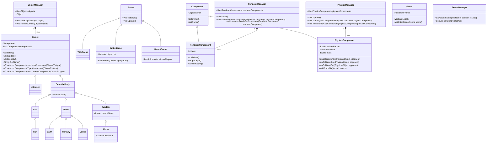

# Class Diagrams

```mermaid
classDiagram
    Object <|-- UiObject
    Object <|-- CelestialBody
    CelestialBody <|-- Star
    Star <|-- Sun
    CelestialBody <|-- Planet
    Planet <|-- Earth
    Planet <|-- Mercury
    Planet <|-- Venus
    CelestialBody <|-- Satellite
    Satellite <|-- Moon

    class Object{
        -String name
        -List~Component~ components
        +void start()
        +void update()
        +void destroy()
        +String GetName()
        +~T extends Component~ void addComponent(Class~T~ type)
        +~T extends Component~ T getComponent(Class~T~ type)
        +~T extends Component~ void removeComponent(Class~T~ type)
    }

    class UiObject{

    }

    class CelestialBody {
        +void display()
    }

    class Star {
    }

    class Sun{

    }

    class Planet {
    }

    class Earth{

    }

    class Mercury{

    }

    class Venus{

    }

    class Satellite {
        +Planet parentPlanet
    }

    class Moon {
        +boolean isNatural
    }

%%
    Scene <|-- TitleScene
    Scene <|-- BattleScene
    Scene <|-- ResultScene

    class Scene{
        +void initialize()
        +void update()
    }

    class TitleScene{

    }

    class BattleScene{
        -List~int~ playerList
        BattleScene(List~int~ playerList)
    }

    class ResultScene{
        ResultScene(int winnerPlayer)

    }

%%Componentクラス
    Component <|-- RendererComponent
    Component <|-- PhysicsComponent

    class Component{
        -Object owner
        +getOwner()
        +setOwner()
    }
    
    class PhysicsComponent{
        -double colliderRadius
        -Vector2 moveDir
        -double mass
        +onCollisionEnter(PhysicalObject opponent)
        +onCollisionStay(PhysicalObject opponent)
        +onCollisionExit(PhysicalObject opponent)
        +addForce2D(Vector2 vector)
    }

    class RendererComponent{
        -int layer
        +void draw()
        +int getLayer()
        +void setLayer()
    }

%%Staticクラス
    RendererManager "1" *-- "many" RendererComponent
    PhysicsManager "1" *-- "many" PhysicsComponent
    ObjectManager "1" *-- "many" Object

    class Game{
        -int currentFrame
        +void runLoop()
        +void SetScene(Scene scene)
    }

    class ObjectManager{
        -List~Object~ objects
        +void addObject(Object object)
        +void removeObject(Object object)
        +Object
    }

    class SoundManager{
        +playSound(String fileName, boolean isLoop)
        +stopSound(String fileName)
    }

    class RendererManager{
        -List~RendererComponent~ rendererComponents
        +void draw()
        +void addRendererComponent(RendererComponent rendererComponent)
        +void removeRendererComponent(RendererComponent rendererComponent)
    }

    class PhysicsManager{
        -List~PhysicsComponent~ physicsComponents
        +void update()
        +void addPhysicsComponent(PhysicsComponent physicsComponent)
        +void removePhysicsComponent(PhysicsComponent physicsComponent)
    }

```
